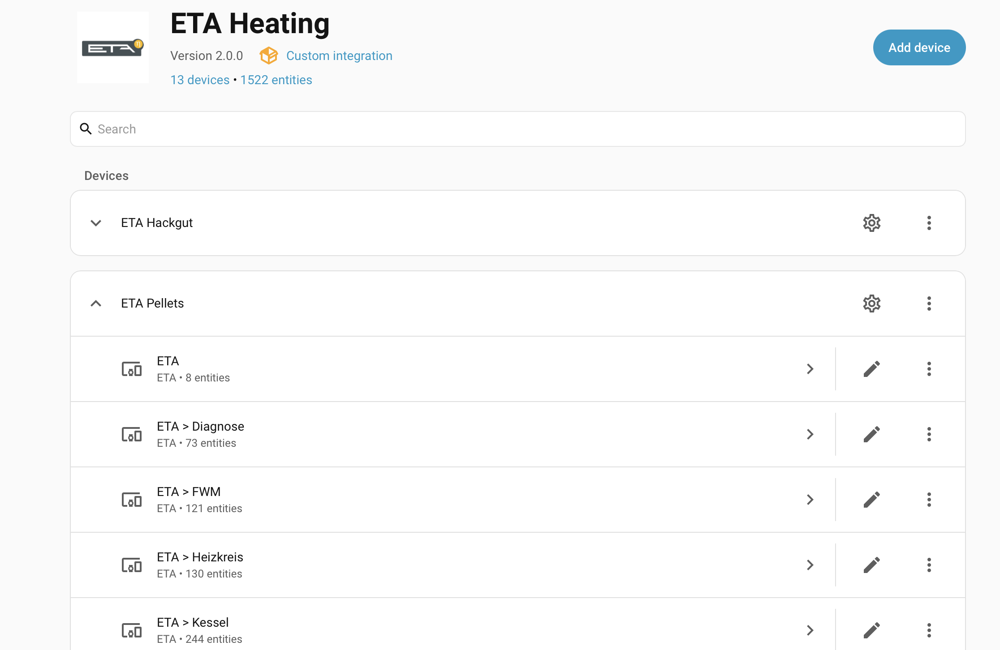
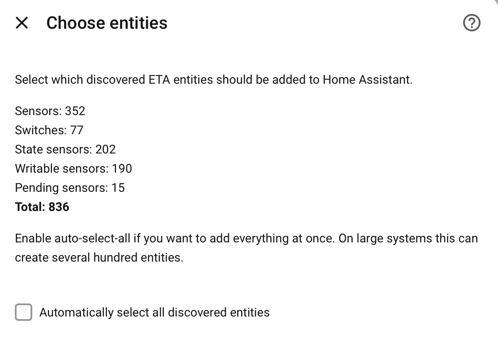

# ETA Heating for Home Assistant

[](https://github.com/hacs/integration)
[](https://github.com/meinETA/homeassistant-eta/releases)
[](https://www.home-assistant.io/)
[](https://github.com/meinETA/homeassistant-eta/actions/workflows/hassfest.yaml)
[](https://github.com/meinETA/homeassistant-eta/actions/workflows/tests.yaml)
[](LICENSE)
[](https://www.buymeacoffee.com/christofpichler)

Home Assistant integration for **ETA heating systems** (pellet, wood, and combined boilers). It reads sensors, states and counters from your ETA unit, and lets you switch and set writable parameters — all discovered automatically over the local [ETA REST API](https://www.meineta.at/javax.faces.resource/downloads/ETA-RESTful-v1.2.pdf.xhtml?ln=default&v=0), no cloud required.

[](https://my.home-assistant.io/redirect/hacs_repository/?owner=meinETA&repository=homeassistant-eta&category=integration)
[](https://my.home-assistant.io/redirect/config_flow_start/?domain=eta_webservices)



## Contents

[Features](#features) · [Prerequisites](#prerequisites) · [Installation](#installation) · [Updating the sensor list](#updating-the-list-of-sensors) · [Error events](#error-events) · [Writable sensors](#writable-sensors) · [Services](#custom-services) · [Energy Dashboard](#integrating-the-eta-unit-into-the-energy-dashboard) · [Troubleshooting](#troubleshooting)

## Features

- **Automatic discovery** of every available endpoint on your ETA unit — with live values shown during setup so you can pick the ones you want.
- **Sensors** for all numeric values (temperatures, pressures, power, flow, counters, …).
- **State sensors** for text states (e.g. `Ready`, `Heating`).
- **Switches** for on/off parameters, detected language-independently.
- **Writable parameters** as `number` entities for setpoints (°C, kg, %, …).
- **Schedules** as `time` entities (API v1.2+).
- **Error monitoring**: a binary sensor for active errors, the active-error count, the latest error message, plus [error events](#error-events) for automations.
- **Services** to write values directly to the unit ([details](#custom-services)).
- **Stable entity identities**: entity ids stay stable across firmware updates, terminal language changes and IP changes.
- **Energy Dashboard** ready ([details](#integrating-the-eta-unit-into-the-energy-dashboard)).

## Screenshots

Every ETA function block becomes a device, and its entities are grouped into the standard Home Assistant cards (Sensors, Configuration, Diagnostic):

|            Sensors             |              Diagnostic              |
| :----------------------------: | :----------------------------------: |
|  |  |

## Prerequisites

- **Compatibility:** works with any ETA unit that exposes the local webservices/REST API — pellet, wood and combined boilers.
- **Activate the webservices API on your ETA unit first** (see the official [documentation](https://www.meineta.at/javax.faces.resource/downloads/ETA-RESTful-v1.2.pdf.xhtml?ln=default&v=0)):
  - Log in to `meinETA`
  - Go to `Settings` in the **middle** of the page (not the bottom one!)
  - Click `Activate Webservices` and follow the instructions
- **API version 1.2 or higher is recommended.** On older firmware the integration falls back to a compatibility mode where some sensors may not be detected or identified correctly, and writable sensors may not work reliably (v1.1 lacks the endpoints needed to query value details). Firmware files are on `meinETA` (`Settings at the bottom → Installation & Software`).
- **Use a fixed address for the unit.** With stable entity identities a changed IP no longer breaks your entities or history, but the integration still connects to the unit by address — so a static DHCP lease (or a DNS name) keeps it reachable.

## Installation

### HACS (recommended)

This integration is available in the **HACS default store**.

1. Open **HACS** and search for **ETA Heating** (or use the *Open in HACS* button above).
2. Click **Download**.
3. Restart Home Assistant.

### Manual

1. Copy the `custom_components/eta_webservices` folder into your Home Assistant `config/custom_components` directory.
2. Restart Home Assistant.

### Add the integration

Go to **Settings → Devices & Services → Add Integration**, search for **ETA Heating** and follow the steps (or use the *Add integration* button above).

During setup the integration discovers everything on your unit and shows the counts per category, so you can pick exactly what you want (or add everything at once):



> **Note:** After you enter host and port, the integration scans every available endpoint once. On large systems (~800 entities) this initial scan can take **8–15 minutes** — please be patient. This only happens when adding the integration or when you explicitly rediscover; normal operation only polls the entities you selected.

## Related Integrations

- [eta-flow](https://github.com/orazefabian/eta-flow) — an animated heat-flow card for visualizing an ETA heating system.

## Updating the List of Sensors

If the sensors on the ETA unit change (e.g. new hardware is added), you can refresh the list:

1. Go to `Settings → Devices & Services → ETA Heating`.
2. Click the gear symbol (`Configure`).
3. Choose one of the actions:
   - **Update API & polling settings** — only changes the request limit and update interval.
   - **Update selected entities** — refreshes the values of your selected entities without rediscovering.
   - **Rediscover available entities and update selected entities** — performs a full rediscovery, then lets you review and adjust your selection.

**Maximum parallel API requests** controls how many requests are sent at once. Higher values are faster but put more load on the unit and can cause timeouts on older devices.

- Older ETA units: `3–5`
- Newer ETA units: `8–15` (if stable)
- If you see API errors/timeouts, reduce the value step by step.

> **Renamed or deleted sensors:** if a sensor you added is renamed on the ETA terminal, the integration cannot automatically link the new name to the existing entity. The old entity is orphaned and the new name appears in the list to be added again. To keep the history, rename the new entity back to the old entity id manually.

## Error Events

The integration publishes an event whenever the ETA terminal reports a new error, or an active error is cleared. These can be handled in automations.

- New error → `eta_webservices_error_detected`
- Cleared error → `eta_webservices_error_cleared`

Each event carries this data:

| Name | Info | Sample Data |
|------------|----------------------------------------------------|---------------------------------------------------------------------------------------------|
| `msg` | Short error message | Water pressure too low 0,00 bar |
| `priority` | Error priority | Error |
| `time` | Time of the error, as reported by the ETA terminal | 2011-06-29T12:48:12 |
| `text` | Detailed error message | Top up heating water! If this warning occurs more than once a year, please contact plumber. |
| `fub` | Functional block of the error | Kessel |
| `host` | Address of the ETA terminal connection | 0.0.0.0 |
| `port` | Port of the ETA terminal connection | 8080 |

### Inspecting a live event

> Only possible while the ETA terminal actually reports an active error.

1. Open Home Assistant in two tabs.
2. Tab 1: `Settings → Devices & Services → Devices → ETA`.
3. Tab 2: `Developer tools → Events`, subscribe to `eta_webservices_error_detected`.
4. Tab 1: click the `Resend Error Events` button.
5. Tab 2: the detailed event info appears.

### Sending a test event

1. `Developer tools → Events`.
2. Event type: `eta_webservices_error_detected`.
3. Event data:
   ```yaml
   msg: Test
   priority: Error
   time: "2023-11-06T12:48:12"
   text: This is a test error.
   fub: Kessel
   host: 0.0.0.0
   port: 8080
   ```
4. Click `Fire Event` — your automation should trigger.

## Writable Sensors

Parameters with a unit of `°C`, `kg` or `%` can be written back to the unit. After adding them via `Configure`, they appear on the ETA device page under **Configuration**.

- The first time you open `Configure` after updating from a version without writable-sensor support, the step takes a while because the integration re-queries the list of valid values from the unit.
- **API v1.1 caveat:** v1.1 lacks the endpoints to query valid value ranges and to tell whether a sensor is writable at all. In compatibility mode the integration guesses the ranges and lists all sensors as potentially writable — you choose the ones that actually are.

> **Caution:** setting a parameter to an invalid value can render your ETA unit unusable. The authors are not responsible for damage caused by writing wrong values.

## Custom Services

The integration provides services to write values to the unit. See the [wiki](https://github.com/meinETA/homeassistant-eta/wiki/Custom-Services) for details.

## Integrating the ETA Unit into the Energy Dashboard

You can add the ETA unit to the Energy Dashboard by converting the total pellet consumption (kg) to energy (kWh) and adding it as a gas source.

Add a template sensor to your `configuration.yaml` (replace the entity id with your own total-consumption sensor). The factor `4.8` is an approximate kWh-per-kg value for wood pellets — adjust it for your fuel:

```yaml
# Convert pellet consumption (kg) to energy consumption (kWh)
template:
  - sensor:
      - name: eta_total_energy
        unit_of_measurement: kWh
        device_class: energy
        state_class: total_increasing
        state: >
          
          
            {{ src | float(0) | multiply(4.8) | round(1) }}
          
            {{ src }}
          
```

You can also create the same helper from the UI:


Then add the new sensor to the gas sources of your Energy Dashboard.

## Troubleshooting

Enable verbose logs in the setup dialog (where you enter host and port) to log all communication. After setup, download them at `Settings → System → Logs → Download Full Log`.

> Logs can be large and may contain data from other integrations. Trim the file before sharing it publicly.

## Development

Run the unit tests from the repository root:

```bash
pip3 install -r requirements_test.txt
python3 -m pytest tests/ -v
```

Found a bug or have an idea? Please [open an issue](https://github.com/meinETA/homeassistant-eta/issues).

## Credits

Originally created by [nigl](https://github.com/nigl/homeassistant_eta_integration) and substantially extended by [Tidone](https://github.com/Tidone/homeassistant_eta_integration); now maintained by Tidone and [christofpichler](https://github.com/christofpichler). Built on the ETA REST API.

## License

Released under the [MIT License](LICENSE).
